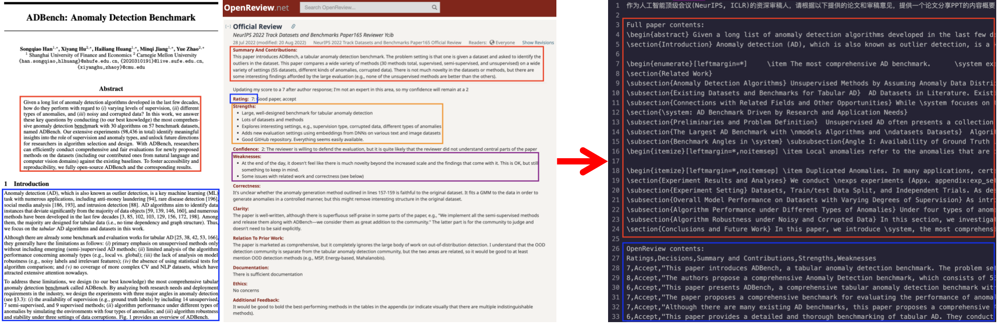

  <h3><b> A Paper Sharing PPT Tool for Weekly Meeting. </b></h3>

---

# ✨ fuck-paper-sharing

fuck-paper-sharing(去踏马的论文分享) is a tool to help you prepare paper sharing PPT in weekly meeting with your supervisor.

Our advantage lies in conducting data cleaning directly on the LaTeX source files, enabling us to obtain accurate and precise text from the papers, without the issues of text omission or formatting errors during pdf2txt conversion due to the imperfections of existing technologies (such as inaccurate OCR recognition).

# 🎯 Get Started

To install the dependencies, run:

`pip install -r requirements.txt`

# 📌 Usage

Open fuck.ipynb and input the title of the paper. (We only support papers that can be both searched in arXiv and OpenReview)

You will get a cleaned latex version of the paper and its OpenReview data, including ratings, decisions, summaries, strengths and weaknesses.

Using the above data, you can DIY with your ChatGPT like: `Help me prepare a paper sharing PPT with the following paper contents.`, `Revise your advice with the following OpenReview comments.`

# 🔗 Highlighted Features

Thanks for OpenAI for ChatGPT, arXiv API, OpenReview API and arxiv-latex-cleaner.
